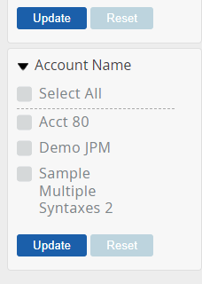
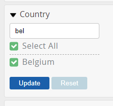

 

# Test Plan 
### Author: Ben Hill 
#### Date: 21/12/21
##### Project: Code Challenge

#### Introduction
This document describes the plan for testing Web Disclosure (WD) 
a public site Glass Lewis clients can make the proxy votes public.

This Test Plan document supports the following objectives:

- Test the client facing functionality -- Country filter list and the Company name vote card 
  
- List the recommended test requirements (high level).
 -- Run tests against the acceptance criteria 
- Recommend and describe the testing strategies to be employed.
 -- Run a suite of automated regression test against the acceptance criteria using cypress
- List the deliverable elements of the test activities.
 -- Test report and visible test artefacts 

#### Resource
List RS/FS Documentation and location or reference PBI’s where the requirements are located
Test files
js
Feature
https://viewpoint.glasslewis.com/WD/?siteId=DemoClient
Cypress 

#### In Scope
- Login page error message
- Country Filter
- Account vote card hyper link 

#### Out of Scope
- Login verification
- API testing

#### Test Methods

All testing is automated using Cypress

#### Test Tools
- Cypress
- Cucumber
- Cucumber test reporter

#### Infrastructure
https://viewpoint.glasslewis.com/WD/?siteId=DemoClient

Assumptions and Risks

Software QA Engineer - Code Challenge 2021

Based on this can you:
1.    Provide a test plan and a set of integration test cases that could be used to test the acceptance criteria.
2.    Provide a full set of automated tests using Selenium Webdriver or Cypress that checks if the actual behavior matches to the acceptance criteria.
3.    Provide instructions on how to run your tests.

4.    Based on what you found difficult or easy from the automation exercise please give some feedback that development team could use to improve the system under test to make it easier to automate.

**The use of data attributes would make it easier to target DOM elements that are otherwise renderd with a dynamic ID**

### How to run the tests

1. Clone the Repo from github and 
2. run npm install then 
3. run npx cypress run to execute the test headlessly
4. or 

    npm run cy:run:chrome
    npm cy:run:firefox

-----------------
Technical requirements

1. Cypress was used as the testing framework

What we are looking for
•         Clean code, easy to understand and maintainable
•         Showing your work through your commit history
•         Test case quality and adequacy
•         How clean and reasonable is the separation of responsibilities
•         Project structure
Extra points (optional):
•         Add support for Cross-Browser Automation Testing (IE, Chrome and Firefox)
•         Tests run heedlessly
•         Tests capture screenshots of failures
•         Containerized project
•         Testing configuration settings are passed as environment variables
•         Tests can be configured to run on various browser

#### Bugs found
- Broken company filter vs link date and  incomplete checkbox list 

- When you filter country by string select all is highlighted 

 
Many update the default filter by country when more than one selected rather than by account name 